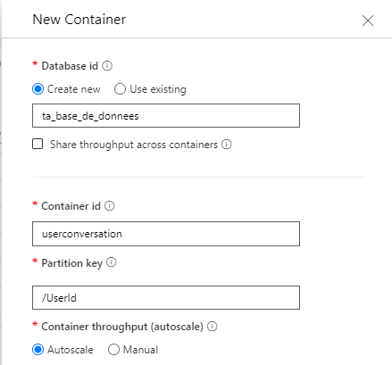

# TOS-ConversationsPersistantesSemanticKernelCosmosDb

À la fin de ce readme, vous serez capable de mettre en place et de gérer des conversations persistantes en utilisant les capacités de traitement du langage de SemanticKernel et le stockage d’Azure Cosmos DB.

## Packages  
Vous aurez besoin d'installer les packages:
- Microsoft.SemanticKernel:**1.6.1**
- Microsoft.Azure.Cosmos:**3.38.1**

## Parametrage de COSMOS DB

Vous pouvez soit utiliser l'emulateur de cosmos db pour jouer avec en local: *https://learn.microsoft.com/en-us/azure/cosmos-db/how-to-develop-emulator?tabs=windows%2Ccsharp&pivots=api-mongodb*, soit demander à vos ops de vous fournir les variables d'env pour se connecter à votre cosmos hébérgé.  
Vous pouvez donc créer un nouvel élément **_AzureCosmosDBSettings_** dans votre projet qui contiendra URI, PrimaryKey, DatabaseName: 
   
    // COSMOS HEBERGE

    public string URI { get; set; } = "votreURI";
    
    public string PrimaryKey { get; set; } = "votrePrimaryKey";
    
    public string DatabaseName { get; set; } = "nimporteQuelNom";

Vous pouvez créer votre base de données, et créer un container userconversation avec une clé de partition /UserId



## Program.cs
Dans votre program.cs, rajoutez :
```
using Microsoft.SemanticKernel;
```
```
//Completion Model GPT 3

// Initialisation du modèle de complétion GPT-3 avec Azure OpenAI

// Ajout du service Azure OpenAI au conteneur de services
builder.Services.AddKernel()
    .AddAzureOpenAIChatCompletion(
        "gpt3", // Nom du déploiement Azure OpenAI : identifie ton instance spécifique du service OpenAI.
        "https://test-open-ia.openai.azure.com/", // Endpoint Azure OpenAI : URL pour accéder au service OpenAI sur Azure.
        "Darja39", // Clé secrète : Utilisée pour s'authentifier et interagir avec le service OpenAI.
        serviceId: "gpt-3" // Identifiant du service : Spécifie le modèle OpenAI à utiliser, ici GPT-3.
    );
```

```
builder.Services.Configure<AzureCosmosDBSettings>(builder.Configuration.GetSection("AzureCosmosDBSettings"));
```

## Création d'un model simple pour stocker le message 

```
public class UserConversation
{
    [JsonProperty("id")]
    public string Id { get; set; }

    [Key]
    [JsonProperty("UserId")]
    public string UserId { get; set; }

    [Required]
    [JsonProperty("ConversationId")]
    public string ConversationId { get; set; }

    [Required]
    [JsonProperty("Message")]
    public string Message { get; set; }

    [Required]
    [JsonProperty("ChatRole")]
    public string ChatRole { get; set; }

    [Required]
    [JsonProperty("DateTimeMessage")]
    public string DateTimeMessage { get; set; }
}

```

## Création du service qui va communiquer avec Cosmos

Créer un CosmosDbService, puis ajoutez votre configuration:

```
    private readonly AzureCosmosDBSettings _azureCosmosDBSettings;

    public CosmosDbService(IOptions<AzureCosmosDBSettings> azureCosmosDBSettings)
    {
        _azureCosmosDBSettings = azureCosmosDBSettings.Value;
    }
```

Faites ensuite la fonction qui va aller chercher le container userconversation: 

```
    private Container UserConversationClient()
    {
        CosmosClient cosmosDbClient = new(_azureCosmosDBSettings.URI, _azureCosmosDBSettings.PrimaryKey);
        Container containerClient = cosmosDbClient.GetContainer(_azureCosmosDBSettings.DatabaseName, "userconversation");
        return containerClient;
    }
```

Vous pouvez avec ca faire la fonction pour insérer l'objet dansle container: 

```
    public async Task<UserConversation> AddUserConversation(UserConversation userConversation)
    {
        var _container = UserConversationClient();

        if(string.IsNullOrEmpty(userConversation.Id))
        {
            userConversation.Id = Guid.NewGuid().ToString();
        }

        var partitionKey = new PartitionKey(userConversation.UserId.ToString());
        var item = await _container.CreateItemAsync(userConversation, partitionKey);
        return item;
    }
```

Et faire la fonction qui va aller chercher tous les anciens messages de la conversation:

```
    public async Task<IEnumerable<UserConversation>> RetrieveAllPreviousMessagesOfConversion(string UserId, string ConversationId)
    {
        Debug.WriteLine($"Récupération des messages pour l'utilisateur {UserId} et la conversation {ConversationId}");

        var queryable = UserConversationClient().GetItemLinqQueryable<UserConversation>();
        using FeedIterator<UserConversation> feed = queryable
            .Where(p => p.ConversationId == ConversationId && p.UserId == UserId)
            .ToFeedIterator();

        List<UserConversation> results = new List<UserConversation>();

        while (feed.HasMoreResults)
        {
            IEnumerable<UserConversation> response = await feed.ReadNextAsync();
            Debug.WriteLine($"Récupéré {response.Count()} messages dans la tranche actuelle.");

            foreach (UserConversation conversation in response)
            {
                results.Add(conversation);
            }
        }

        Debug.WriteLine($"Nombre total de messages récupérés : {results.Count}");
        return results;

    }
```

Vous êtes maintenant pret à créer un nouveau message pour un user donné et une conversation donné, et à récupérer tous les anciens messages

## Création du service qui va faire appel au Semantic Kernel

Créez votre service, puis ajoutez votre configuration: 

```
    private readonly ICosmosDbService _cosmosDbService;
    private readonly Kernel _kernel;

    public ChatService(IConfiguration configuration, ICosmosDbService cosmosDbService, Kernel kernel)
    {
        _cosmosDbService = cosmosDbService;
        _kernel = kernel;
    }
```

Voici la signature de la méthode utilisée:
```
    async Task<string> AddMessageAndGetResponse(string conversationId, string message)
```

Créez votre instance de service IChatCompletionService avec votre nom de déploiement:

```
        var chat = _kernel.Services.GetRequiredKeyedService<IChatCompletionService>("gpt-3");
```

Pour l'exemple on va dire que le userId est "1". Allez donc chercher tous les messages precedents pour la conversation renseignée en parametre de la fonction et le user 1. On se sert de la fonction precedente du service Cosmos:

```
var messageHistory = await _cosmosDbService.RetrieveAllPreviousMessagesOfConversion(_userId, conversationId);
var chatHistory = new ChatHistory();
```

On rajoute à notre objet ChatHistory toutes les conversations passées: 

```
foreach (var msg in messageHistory)
{
    if (msg.ChatRole == "User")
    {
        chatHistory.AddUserMessage(msMessage);
    }
    else
    {
        chatHistory.AddSystemMessa(msg.Message);
    }
}
```

On enregistre après tout ca le message que l'utilisateur vient d'envoyer:

```
await _cosmosDbService.AddUserConversation(new UserConversation
{
    UserId = _userId,
    ConversationId conversationToWorkWitConversationId,
    Message = userMessage,
    ChatRole = "User",
    ModelUsedForResponse = null,
    DateTimeMessage = DateTime.UtcNoToString("yyyy-MM-ddTHH:mm:ssZ"),
});

chatHistory.AddUserMessage(userMessage);
```

On récupère la réponse on l'enregistre dans le container, avec le bon id de conversation et le bon userId: 

```
var response = await chat.GetChatMessageContentAsync(chatHistory);

var content = response.Content; 

//Enregistre le message utilisateur dans Cosmos DB
await _cosmosDbService.AddUserConversation(new UserConversation
{
    UserId = _userId,
    ConversationId = conversationId,
    Message = content,
    ChatRole = "System",
    DateTimeMessage = DateTime.UtcNoToString("yyyy-MM-ddTHH:mm:ssZ"),
});
```

Puis plus qu'à retouner la réponse pour que la string soit accessible sur l'endpoint que vous avez défini:

```
return content;
```

Vous pouvez maintenant en configurant votre endpoint, envoyer un message, insérer votre premier message dans cosmos, récupérer s'ils existent tous les anciens messages de la conversion, enregistrer la réponse de l'IA dans votre container, et lire sa réponse. Réitérez le processus pour pouvoir dialoguer avec.

-----------------------------------------------  
>"Les farfadets malicieux, dans leur espièglerie, nous enseignent que même le plus petit des êtres peut changer le cours d'une rivière, nous rappelant ainsi que la grandeur ne réside pas dans la taille, mais dans l'impact de nos actions."
>
> Aurélien Bissey - 2024